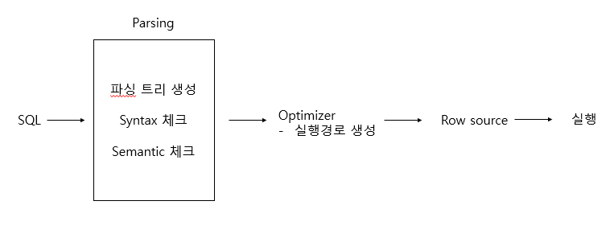
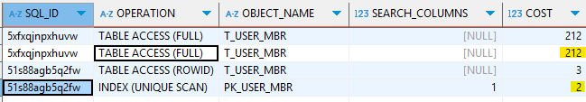

## SQL 최적화

DBMS 내부에서 프로시저를 작성하고 컴파일해서 실행 가능한 상태로 만드는 전 과정

### SQL 실행 단계



1. **SQL 파싱**
    
    사용자로부터 SQL을 전달받으면 Parser가 파싱한다.
    
    - 파싱 트리: SQL문을 이루는 개별 구성요소 분석 후 파싱 트리 생성
    - Syntax 체크: 문법적 오류가 없는지 확인(키워드, 순서)
    - Semantic 체크: 의미상 오류가 없는 확인(테이블, 컬럼, 오브젝트 권한)
2. **SQL 최적화**
    
    SQL 최적화는 [옵티마이저](#SQL-옵티마이저)가 맡는다.
    
3. **로우 소스 생성**
    
    로우 소스 생성기가 SQL 옵티마이저가 선택한 실행경로를 실제 실행 가능한 코드 또는 프로시저 형태로 포맷팅한다.
    

## SQL 옵티마이저

**옵티마이저(Optimizer)**

미리 수집한 시스템 및 오브젝트 통계정보를 바탕으로 다양한 실행경로를 생성해서 비교한 후 가장 효율적인 하나를 선택한다. (성능의 핵심 엔진!)

1. 전달받은 쿼리를 수행하는 데 후보군이 될만한 실행계획들을 찾아낸다.
2. 데이터 딕셔너리에 미리 수집해 둔 오브젝트 통계 및 시스템 통계정보를 이용해 각 실행계획의 예상비용을 산정한다.
3. 최저 비용을 나타내는 실행계획은 선택한다.

## 실행계획과 비용



DBMS에서 ‘SQL 실행경로’ 를 조회할 수 있다. 미리보기를 통해 SQL이 데이터를 가져오기 위해 어떤 스캔을 하는지 확인 할 수 있고, 필요하다면 실행 경로를 변경할 수 있다.

**cost**: 쿼리를 수행하는 동안 발생할 것으로 예상하는 I/O 횟수 또는 예상 소요시간을 표현한 값

## 옵티마이저 힌트

DBMS가 실행 계획을 최적화할 때 개발자가 특정 방식으로 실행하도록 유도하는 방법

DBMS는 보통 **통계 정보(Statistics)** 를 기반으로 자동으로 최적의 실행 계획을 선택하지만,

- **잘못된 통계 정보**
- **특정 실행 계획을 강제하고 싶을 때**

이런 경우에는 옵티마이저 힌트를 사용해서 직접 실행 계획을 컨트롤할 수 있다.

### **대표적인 힌트 종류 (DBMS마다 다름)**

| **힌트 종류** | **설명** | **사용 예시** |
| --- | --- | --- |
| **조인 방식 강제** | 특정 조인 방식을 강제함 | `/*+ USE_NL(A B) */` |
| **조인 순서 강제** | 테이블의 조인 순서를 지정함 | `/*+ LEADING(A B C) */` |
| **인덱스 사용 강제** | 특정 인덱스를 사용하도록 강제 | `/*+ INDEX(table index_name) */` |
| **인덱스 사용 방지** | 특정 인덱스를 사용하지 않도록 강제 | `/*+ NO_INDEX(table index_name) */` |
| **병렬 처리 적용** | SQL 실행을 병렬로 수행 | `/*+ PARALLEL(table 4) */` |
| **FULL 스캔 강제** | 테이블 풀 스캔을 강제 | `/*+ FULL(table) */` |
| **INDEX 스캔 강제** | 특정 인덱스를 통한 검색 강제 | `/*+ INDEX(table index_name) */` |
| **SORT MERGE 조인 강제** | Sort Merge Join 사용 | `/*+ USE_MERGE(A B) */` |
| **CARDINALITY 설정** | 특정 테이블의 예상 행 수를 지정 | `/*+ CARDINALITY(table 1000) */` |
| **FIRST_ROWS / ALL_ROWS** | 응답 속도 또는 전체 처리 속도 최적화 | `/*+ FIRST_ROWS(10) */` |

```sql
/*+ USE_NL(A B) */
-- A, B 테이블을 Nested Loop Join 사용
/*+ USE_HASH(A B) */
-- A, B 테이블을 Hash Join 사용, B가 해시 테이블로 올라감-- NL 조인 강제
SELECT/*+ USE_NL(usr ord) */
	usr.이름, ord.상품이름, ord.주문일자
FROM T_USER usr
JOIN T_ORDER ord  ON usr.user_id = ord.user_id

/*+ LEADING(A B C) */
-- A → B → C 순서대로 조인 강제
-- ord 테이블을 먼저 읽도록 강제
SELECT/*+ LEADING(ord usr) */
	usr.이름, ord.상품이름, ord.주문일자
FROM T_USER usr
JOIN T_ORDER ord  ON usr.user_id = ord.user_id

/*+ INDEX(table index_name) */
-- 테이블의 index_name 사용
/*+ NO_INDEX(table index_name) */
-- 테이블의 index_name 사용x-- 해시 조인, idx_user_id 인덱스 사용
SELECT/*+ USE_HASH(usr ord) INDEX(usr idx_user_id) */
	usr.이름, ord.상품이름, ord.주문일자
FROM T_USER usr
JOIN T_ORDER ord  ON usr.user_id = ord.user_id

/*+ PARALLEL(table 4) */
-- 테이블을 4개의 프로세스가 병렬로 처리하도록 강제
SELECT/*+ PARALLEL(T_ORDER 4) */
       user_id, 상품이름, 주문일자
FROM T_ORDER;

```

**주의점**

1. 힌트는 DBMS에 따라 다르다.
2. 힌트를 무조건 쓰면 안된다.
    - 옵티마이저가 최적 실행 계획을 찾는 경우가 많음
    - 장기적으로 유지보수가 어려워질 수 있음