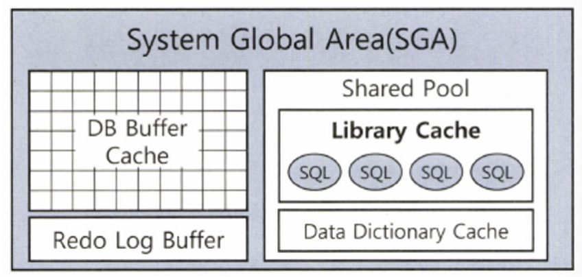
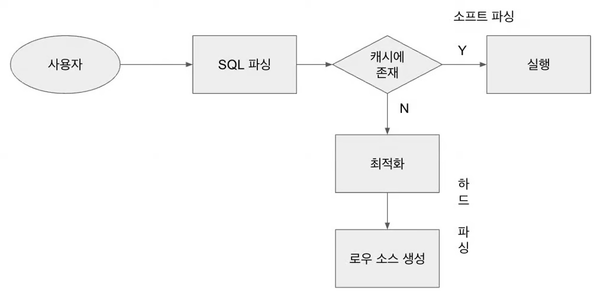

## 소프트 파싱 vs 하드 파싱

**라이브러리 캐시**

SQL 파싱, 최적화, 실행계획 수립, 로우 소스 생성 과정을 거쳐 생성한 내부 프로시저(실행 가능한 형태의 SQL)를 반복 재사용할 수 있도록 저장해두는 메모리 공간. Oracle의 SGA(System Global Area) 내에 존재하며, SQL 성능과 자원 효율성에 큰 영향을 준다.




**SGA(System Global Area)**

서버 프로세스와 백그라운드 프로세스가 공통으로 액세스하는 데이터 및 제어 구조를 캐싱하는 메모리 영역. 주요 구성 요소에는 **라이브러리 캐시**, **데이터 캐시 버퍼**, **리두 로그 버퍼** 등이 있다.

### **SQL 실행 흐름**




1. SQL문이 데이터베이스로 전달됨
2. 파서(Parser)가 SQL을 파싱하고, 라이브러리 캐시에 동일한 SQL이 존재하는지 확인
    - **소프트 파싱 (Soft Parse)**
        
        동일한 SQL이 이미 라이브러리 캐시에 존재하면, 기존의 실행 계획을 재사용해 곧바로 실행
        
        → **빠르고 효율적**
        
    - **하드 파싱 (Hard Parse)**
        
        SQL이 처음이거나 캐시에 존재하지 않으면, 파싱 → 구문 분석 → 최적화 → 실행 계획 수립 등 복잡한 작업을 새로 수행
        
        → **CPU 자원 소모 많고 비효율적**
        
        💡 **하드 파싱은 성능 저하의 주요 원인 중 하나**로, 시스템 자원을 과도하게 사용할 수 있다.
        

## 바인드 변수의 중요성

### 이름없는 SQL 문제

함수, 프로시저, 트리거, 패키지 등은 이름을 갖고 딕셔너리에 저장되지만, **SQL 문은 이름이 없으며** 그 자체가 키 역할을 한다.

즉, **SQL 텍스트가 곧 식별자**이기 때문에 조금이라도 달라지면 다른 SQL로 인식된다.

이런 SQL은 다음과 같은 과정을 거친 후 라이브러리 캐시에 적재되지만:

- 의미적으로 동일한 SQL이라도, 문장 구조(공백, 대소문자, 상수 값 등)가 다르면 전혀 다른 SQL로 처리되어 **재사용이 되지 않는다**
- 결과적으로 캐시에 많은 SQL이 누적되고, **성능 저하와 메모리 낭비**를 초래한다
- 예: 아래 두 문장은 전혀 다른 SQL로 인식됨
    
    ```sql
    SELECT * FROM EMP WHERE EMPNO = 7900;
    select * from emp where empno = 7900;
    
    -- 실행할 때 각각 최적화를 진행하고 라이브러리 캐시에서 별도 공간을 사용한다.
    ```
    

### 공유 가능 SQL

**바인드 변수 (Bind Variable)** 

 SQL문 안에서 값(데이터)을 고정하지 않고, 나중에 외부에서 넣을 수 있도록 만든 변수

바인드 변수를 사용하면 SQL 텍스트의 구조를 고정하고, 값만 외부에서 바인딩해 넘길 수 있다.

```sql
SELECT * FROM EMP WHERE EMPNO = :empno;
```

이렇게 하면, 동일한 SQL 구조가 유지되어 **하드 파싱은 최초 1회만 일어나며**, 이후부터는 **소프트 파싱으로 빠르게 재사용** 가능하다.

**장점**

- SQL 공유 가능성 증가
- 라이브러리 캐시 사용 효율 향상
- 하드 파싱 빈도 감소 → CPU 사용량 절감
- 성능 개선 및 확장성 확보

### 요약

| 구분 | 하드 파싱 | 소프트 파싱 |
| --- | --- | --- |
| SQL 존재 여부 | 없음 | 있음 |
| 비용 | 높음 (파싱 + 최적화 + 계획 수립) | 낮음 (재사용) |
| 성능 영향 | 부정적 | 긍정적 |
| 바인드 변수 사용 시 | 첫 실행만 하드 파싱 이후 모두 소프트 파싱 | 동일 SQL 재사용 가능 |