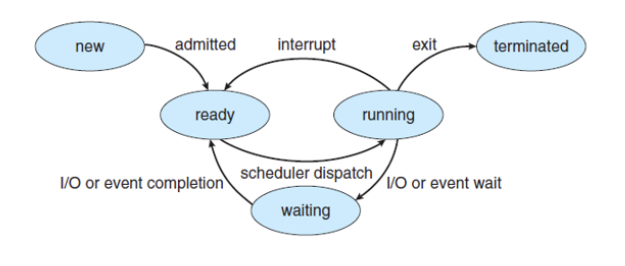
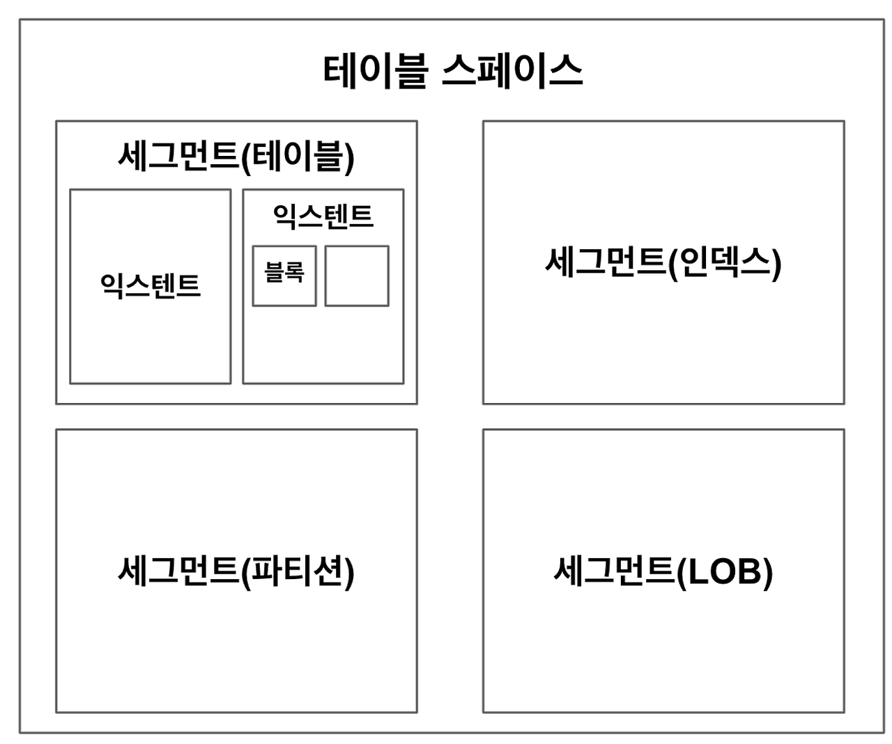
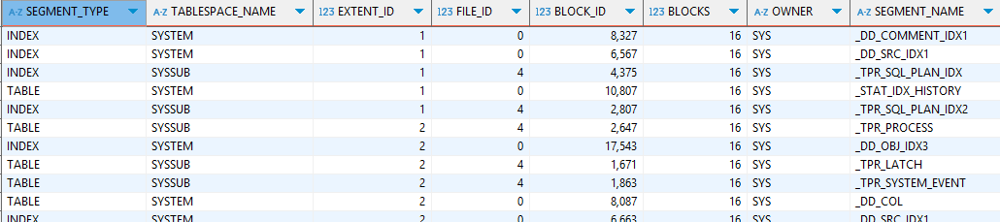
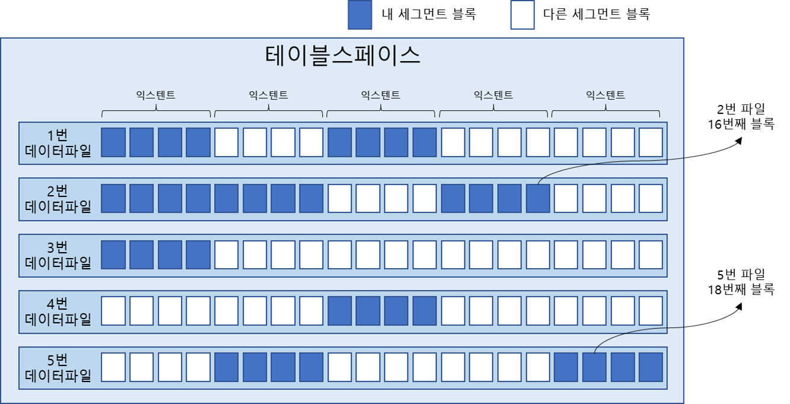
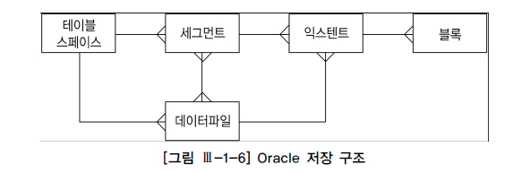
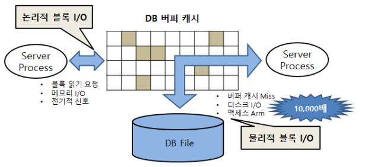
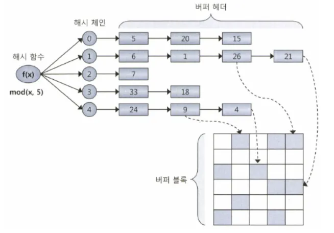

## SQL이 느린 이유

**디스크 I/O** 때문

- I/O는 곧 **sleep** (OS/I/O 서브시스템이 처리 중인 동안 프로세스는 대기)
- 여러 프로세스가 하나의 CPU를 공유 → 동시 실행 불가
- interrupt가  없어도 디스크에서 데이터를 읽을 땐 CPU 반환 → 대기
- **I/O가 많아지면 자연스럽게 SQL 성능 저하**
    - 예: Single Block I/O로 10,000 블록을 읽는다면 10초 이상 소요
- I/O 튜닝이 안 된 시스템은 **디스크 경합 심화 → 더 느려짐**



즉, 디스크 I/O가 SQL 성능을 좌우한다. 

## 데이터베이스 저장 구조



### 기본 구성

**테이블스페이스**

- 논리적인 저장 단위
- 세그먼트들을 담는 논리적 컨테이너로, 여러 개의 데이터파일로 구성됨

**데이터파일**

- 실제 OS 상의 물리적인 파일.
- 테이블스페이스에 속하며, 데이터가 실제로 저장되는 장소.

**세그먼트**

- 테이블, 인덱스 등 객체 단위로 할당되는 저장 공간
- 테이블 또는 인덱스를 생성할 때, 해당 데이터가 저장될 테이블스페이스를 지정함
- 하나 이상의 익스텐트로 구성되며, 익스텐트를 통해 공간을 확장해 나감

**익스텐트**:

- 연속된 블록의 집합, 공간 확장의 최소 단위
- 하나의 익스텐트는 하나의 세그먼트에 속하며, 다른 세그먼트와 공유되지 않는다.
- 익스텐트는 항상 하나의 데이터파일 내에 위치한다.
    - 세그먼트가 여러 익스텐트를 가짐에 따라, 이 익스텐트들이 여러 데이터파일에 분산될 수 있어 파일 I/O 경합이 줄어든
- 세그먼트가 커지면 새로운 익스텐트를 필요할 때마다 할당받는다.
- 하나의 익스텐트는 하나의 세그먼트가 독점한다.

**블록**

- 실제 데이터를 저장하는 최소 단위
- 하나의 블록은 하나의 세그먼트에 속하며, 여러 객체가 공유하지 않음

세그먼트 공간이 부족해지만 테이블스페이스로부터 익스텐트를 추가로 할당받는다. 

하나의 테이블스페이스를 여러 데이터파일로 구성하면 파일 경합을 줄이기 위해 DBMS가 데이터를 가능한 한 여러 데이터파일로 분산해서 저장하기 때문에 세그먼트에 할당된 모든 익스텐트는 같은 데이터 파일에 위치하지 않을 가능성이 높다. 

```sql
-- 사용자(SYS)의 세그먼트가 어떤 익스텐트와 파일에 어떻게 분포되어 있는지를 확인
SELECT SEGMENT_TYPE, TABLESPACE_NAME, EXTENT_ID, FILE_ID, BLOCK_ID, BLOCKS, OWNER, SEGMENT_NAME
FROM DBA_EXTENTS
WHERE OWNER = 'SYS'
ORDER BY EXTENT_ID;
```






익스텐트 내 블록은 서로 인접한 연속된 공간이지만, 익스텐트끼리는 연속된 공간이 아니다.



## 블록단위 I/O

- 오라클의 기본 블록 크기: **8KB**
- 1바이트 읽어도 **블록 전체(8KB)** 를 읽음
- **인덱스도 블록 단위로 I/O 수행한다.**

```sql
SHOW PARAMETER db_block_size;
SELECT value FROM v$parameter WHERE name = 'db_block_size';
```

## 시퀀셜 액세스 VS 랜덤 액세스

**시퀀셜 액세스**

- 블록을 순서대로 읽음 (인덱스, 풀 테이블 스캔 등)
    - 인덱스 리프 블록은 앞뒤를 가리키는 주소값을 통해 논리적으로 서로 연결돼 있다. 이 주소 값에 따라 순차적으로 스캔한다.
    - 오라클은 세그먼트에 할당된 익스텐트 목록을 세그먼트 헤더에 맵으로 관리한다. 맵에서 읽어야 할 익스텐트 목록을 얻고, 각 익스텐트의 첫 번째 블록 뒤에 연속해서 저장된 블록을 순서대로 스캔하는 것이 풀 테이블 스캔이다.
- 멀티블록 I/O와 잘 맞음
- **랜덤 액세스**
    - 필요한 블록만 각각 따로 읽음 (인덱스 접근)
    - 싱글 블록 I/O 방식

## 논리적  I/O VS 물리적  I/O

### DB 버퍼 캐시

- 자주 읽는 블록을 메모리에 저장
- **논리적 I/O = 대부분 메모리 I/O**
- 디스크에서 읽는 경우만 **물리적 I/O**
- sga의 구성요소
    - 라이브러리 캐시: sql 실행계획, db 저장형 함수/프로시저 등을 캐싱하는 ‘코드 캐시’
    - db버퍼 캐시: 같은 블록에 대한 반복적인 I/O Call을 줄이기 위해 디스크에서 읽은 데이터 블록을 캐싱해두는 ‘데이터 캐시’로

```sql
SHOW SGA
```

서버 프로세스와 데이터 파일 사이에 버퍼캐시가 있으면 데이터 블록을 읽을 땐 항상 버퍼캐시부터 읽는다. 

### 논리적  I/O VS 물리적  I/O



**논리적 I/O**

- SQL 수행 중 발생한 **전체 블록 읽기**
- 일반적으로 메모리상의 버퍼 캐시를 경유하므로 메모리 I/O 가 곧 논리적 I/O다.
    - 논리적 I/O가 메모리 I/O와 같은 개념은 아니지만 결과적으로 수치는 같다.

**물리적 I/O**

- 버퍼캐시 미스 시 발생하는 **디스크에서의 실제 읽기**
- 데이터 입력이나 삭제가 없어도 물리적 I/O는 sql을 실행할 때마다 다르다.

`INDEX RANGE SCAN` 시 논리적 I/O는 증가하지만 물리적 I/O는 적을 수 있다

### 버퍼캐시 히트율 (Buffer Cache Hit Ratio)

`BCHR = (캐시에서 곧바로 찾은 블록 수 / 총 읽은 블록 수) * 100`

`= ((논리적 I/O - 물리적 I/O)  /  논리적 I/O) * 100`

`= (1 - (물리적 I/O) / (논리적 I/O)) * 100`

- 일반적으로 99% 이상이 되어야 안정적이다.

논리적 I/O는 일정하므로 물리적 I/O는 BCHR에 의해 결정된다.  BCHR은 시스템 상황에 따라 달라지므로 물리적 I/O는 결국 시스템 상황에 의해 결정되는 통제 불가능한 외생변수다. 즉, SQL 성능을 높이기 위해서는 논리적  I/O를 줄여야 한다. 

SQL 을 튜닝해서 읽는 총 블록 개수를 줄이면 논리적 I/O를 줄일 수 있다. 논리적 I/O는 일정하게 발생하지만 SQL 튜닝을 통해 줄일 수 있다. 즉, **논리적 I/O 줄여 물리적 I/O를 줄이는 것이 SQL튜닝이다.**

`물리적 아이오 = 논리적 I/O * (100% -BCHR)`

**SQL 성능 향상 핵심 = 논리적 I/O 감소**

- 물리적 I/O는 환경에 따라 달라지는 외생 변수
- 논리적 I/O는 튜닝 가능한 내생 변수

### Single Block I/O vs

|  | 설명 |
| --- | --- |
| Single Block I/O | 한 번에 한 블록씩 요청해서 메모리에 적재(인덱스 액세스, 랜덤 액세스) |
| Multi Block I/O | 한 번에 여러 블록씩 요청해서 메모리에 적재 (풀 스캔, 연속 블록 미리 읽기) |

```sql
-- 멀티 블록 I/O 최대 크기 결정 파라미터로, 테이블 풀 스캔 시 블록을 몇 개까지 동시에 읽을 수 있는지를 제어함.
-- 실제 환경에서는 I/O 서브시스템 성능에 따라 자동 조정되기도 하며, 너무 큰 값은 경합이나 I/O 지연을 유발할 수도 있음.
SHOW PARAMETER db_file_multiblock_read_count
```

※ 멀티블록 I/O는 **익스텐트 경계는 넘지 못함**

**Single Block I/O**

- 인덱스 루트 블록을 읽을 때
- 인덱스 루트 블록에서 얻은 주소 정보로 브랜치 블록을 읽을 때
- 인덱스 브랜치 블록에서 얻은 주소 정보로 리프 블록을 읽을 때
- 인덱스 리프 블록에서 얻은 주소 정보로 테이블 블록을 읽을 때

**Multi Block I/O**

- 많은 데이터 블록을 읽을 때
- 테이블 전체를 스캔할 때
- 테이블이 클수록 멀티블록 아이오 단위도 크면 좋다.
- 대용량 테이블을 풀 스캔할 때
- 캐시에서 찾지 못한 특정 블록들을 읽으려고 I/O Call 할 때 디스크 상에 그 블록과 인접한 블록들을 한꺼번에 읽어 캐시에 미리 적재하는 기능

## Table Full Scan vs Index Range Scan

 **Table Full Scan**

- 전체 테이블을 읽고 필터링
- **시퀀셜 액세스 + 멀티블록 I/O**
- 집계 쿼리, 배치 등에 적합
- 한 블록에 속한 모든 레코드를 한 번에 읽어들인다. 캐시에서 찾지 못하면 한 번의 수면을 통해 인접한 수십~수백 개 블록을 한꺼번에  I/O 한다.

**Index Range Scan**

- 인덱스를 따라 rowid로 테이블 레코드 접근
    - rowid: 테이블 레코드가 디스크 상에 어디 저장됏는지를 가리키는 위치 정보
- **랜덤 액세스 + 싱글 블록 I/O**
- 소량 데이터 조회에 적합
- **같은 블록 반복 읽기 → 논리적 I/O 증가 가능**
- 읽었던 블록을 반복해서 읽기 때문에 물리적인 블록  I/O 뿐만 아니로 논리적인 블록  I/O 측면에서도 불리하다.

## 캐시 탐색 메커니즘

- 모든 블록 I/O는 (Direct Path 제외) **버퍼캐시 경유한다.**
- 해시 알고리즘으로 버퍼헤더를 탐색하여 포인터 획득한다.
    - 해시 체인 내부는 정렬되지 않는다.
    - 같은 입력 값은 항상 동일한 해시 체인(버킷)에 연결된다.
    - 다른 입력 값이 동일한 해시 체인에 연결될 수 있음



※ **Direct Path Read**

- 버퍼 캐시를 우회하고 디스크에서 직접 읽는 방식.
- 버퍼 캐시를 경유하지 않는 예외적인 경로
- 대용량 테이블 접근 시 발생.

### 메모리 공유자원에 대핸 액세스 직렬화

버퍼캐시에 캐싱된 버퍼블록은 모두 공유자원으로 누구나 접근할 수 있다. 그런데 하나의 버퍼블록을 두 개 이상 프로세스가 동시에 접근하려고 하면 블록 정합성에 문제가 생길 수 있다. 따라서 공유자원이라도 내부에선 한 프로세스씩 순차적으로 접근하도록 구현해야한다. 

- 공유 자원은 **직렬화** 필요 → `래치(latch)` 사용
- sga를 구성하는 서브 캐시마다 별도의 래치가 존재한다.
    - 버퍼캐시에는 **캐시버퍼 체인 래치**, **LRU 체인 래치** 존재
    
- 버퍼블록 자체에도 직렬화 매커니즘이 존재한다. → **버퍼락(buffer lock)**
- 경합 줄이기 위해서는 **SQL 튜닝을 통한 작업량 자체를 줄여야 한다.**